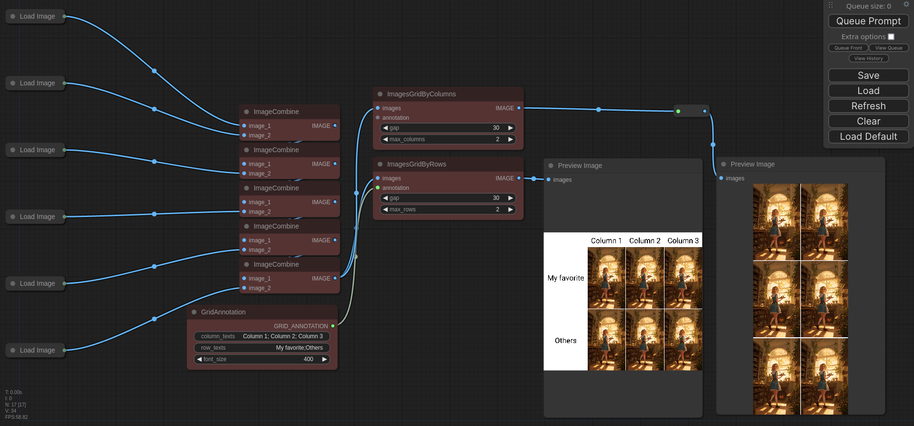
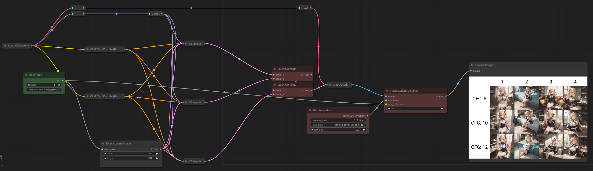

# ImagesGrid: Comfy plugin



[Workflows](./workflows/mini.json)

[Workflows](./workflows/base.json)


## How to use

### Install

https://github.com/LEv145/images-grid-comfy-plugin/archive/refs/heads/main.zip
```
cd custom_nodes  # From comfy path
git clone https://github.com/LEv145/images-grid-comfy-plugin ImagesGrid
```
### Update

```
cd custom_nodes/ImagesGrid
git pull
```
