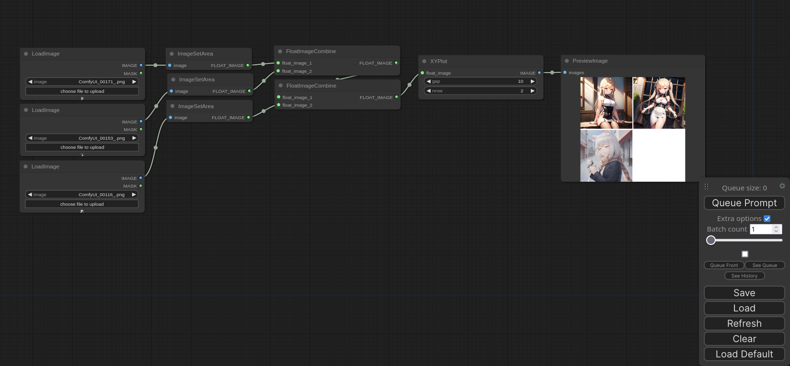

# XYPlot: Comfy plugin



[Workflows](./workflows/xy_plot_mini.json)

[Workflows](./workflows/xy_plot_base.json)


## How to use

### Install

```
cd custom_nodes  # From comfy path
git clone https://github.com/LEv145/XY-plot-comfy-plugin XYPlot
```
### Update

```
cd custom_nodes/XYPlot
git pull
```
