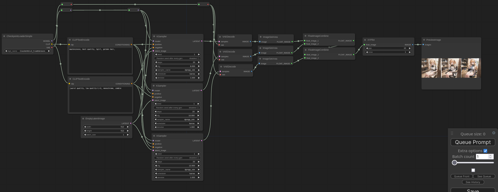

# XYPlot: Comfy plugin





## How to use

### Install

```
cd custom_nodes  # From comfy path
git clone https://github.com/LEv145/XY-plot-comfy-plugin XYPlot
```
### Update

```
cd custom_nodes/XYPlot
git pull
```

## Workflows

[Workflows](./workflows)
